# 05/04/2024

- learnt git commands (add, commit, push, pull, branch, checkut, merge, reset)
- learnt markdown syntax
- learnt django
    - built a simple text analyzer which accepts a string and converts it into uppercase, lowercase and remove punctuation 
  ---
  
# 08/04/2024

- built a simple e-com website using django containing features like home , about, contact, services (fetching data from database)
- learnt postgress sql for integrating with django 
  

# 10/04/2024

- learnt react-redux and redux-toolkit
- learn how to fetch data using reddux-toolkit-query(RTK)
  
# 11/04/2024
  <details>
  <summary>Linux Commands</summary>

  ## File Operations

  - **ls**: List files and directories.
  - **Options**: `-l` (Long format listing), `-a` (Include hidden files), `-h` (Human-readable file sizes).
  - **Examples**: `ls -l`, `ls -a`, `ls -lh`.

  - **cd**: Change directory.
  - **Examples**: `cd /path`.

  - **pwd**: Print current working directory.
  - **Examples**: `pwd`.

  - **mkdir**: Create a new directory.
  - **Examples**: `mkdir my_directory`.

  - **rm**: Remove files and directories.
  - **Options**: `-r` (Remove directories recursively), `-f` (Force removal without confirmation).
  - **Examples**: `rm file.txt`, `rm -r my_directory`, `rm -f file.txt`.

  - **cp**: Copy files and directories.
  - **Options**: `-r`
  - **Examples**: `cp -r directory destination`, `cp file.txt destination`.

  - **mv**: Move/rename files and directories.
  - **Examples**: `mv file.txt new_name.txt`, `mv file.txt directory`.

  - **touch**: Create an empty file or update file timestamps.
  - **Examples**: `touch file.txt`.

  - **cat**: View the contents of a file.
  - **Examples**: `cat file.txt`.

  - **head**: Display the first few lines of a file.
  - **Options**: `-n` (Specify the number of lines to display).
  - **Examples**: `head file.txt`

  - **tail**: Display the last few lines of a file.
  - **Options**: `-n` (Specify the number of lines to display).
  - **Examples**: `tail file.txt`

  - **ln**: Create links between files.
  - **Options**: `-s` (Create symbolic (soft) links).
  - **Examples**: `ln -s source_file link_name`.

  - **find**: Search for files and directories.
  - **Options**: `-name`  `-type` 
  - **Examples**: `find /path -name "*.txt"`.

  ## File Permission Commands

  - **chmod**: Change file permissions.
  - **Options**: `u` (User/owner permissions), `g` (Group permissions)

  - **umask**: Set default file permissions.
  - **Examples**: `umask 022`.

  ## File Compression and Archiving Commands

  - **gzip**: Compress files.
  - **Examples**: `gzip file.txt`.

  - **zip**: Create compressed zip archives.
  - **Examples**: `zip archive.zip file1.txt file2.txt`.

  </details>
  
#### learnt about django-rest-framework

# 15/04/2024
  <details>
  <summary>OOP's</summary>

  ## Class and Object

  ```python
  class Car:
      total_calls = 0
      
      def __init__(self, model, brand):
          self.model = model
          self.brand = brand
          Car.total_calls += 1

      def __str__(self):
          return f"Model -> {self.model} & Brand -> {self.brand}, {Car.total_calls}"

  Maruti = Car("maruti", "new")
  print(Maruti)
  ```
  ## Inheritance
  ``` python
  class ElectricCar(Car):
      def __init__(self, model, brand, battery):
          super().__init__(model, brand)
          self.battery = battery
      
      def __str__(self):
          return f'Model->{self.model} , Brand->{self.brand} , Battery->{self.battery}, {Car.total_calls}'
      
  ec = ElectricCar("ola", "good", "85kwh")
  print(ec)
  ```

  ## Encapsulation
  ``` python
  class Employee:
      def __init__(self, name, salary):
          self.name = name
          self.__salary = salary  # private 

      def __str__(self):
          return f"Employee Name->{self.name} and salary->{self.__salary}" 
      
      def get_salary(self):
          return self.__salary
      
      def set_salary(self, salary):
          self.__salary = salary

  satyam = Employee("satyam", "10l")
  print(satyam)    

  print(satyam.get_salary())
  ```
  ## Static Methods
  ```python
  class Laptop:
      def __init__(self, brand):
          self.brand = brand

      @staticmethod
      def use():
          return f"Laptops are used for educational purposes"
      
      def __str__(self):
          return self.brand

  lenovo = Laptop("Lenovo")
  apple = Laptop("Apple")
  print(lenovo.use())  # Accessed through objects
  print(apple.use())   # Accessed through objects
  print(Laptop.use())  # Accessed through classes

  ```
  </details>


  <details>
  <summary>Decorators</summary>

  ## Timing Function

  ```python
  import time

  def toll(func):
      def wrapper():
          start = time.time()
          print("Before called")
          result = func()
          print("After called")
          end = time.time()
          print(f"{func.__name__} ran in {end-start}")
          return result
      return wrapper

  @toll
  def running_function():
      print("I am called")
      time.sleep(3)

  running_function()
  ```

  ## Debug function
  ``` python 
  def debug(func):
      def wrapper(*args, **kwargs):
          args_value = (",").join(args)
          kw_args = (',').join(f" {k}->{v}" for k, v in kwargs.items())
          print(f"calling {func.__name__} with args {args_value} and kwargs {kw_args}")
          result = func(*args, **kwargs)
          return result
      return wrapper

  @debug
  def database(name, description, use="development", db="database"):
      print("database is called")

  database("mongodb", "sql", use="development", db="database")

  ```
  </details>

  <details>
  <summary>exception handling</summary>

  ```python
  try:
      print('Resource opened')
      x=int(input("Enter 1st number b/w 1 to 100->"))
      if(x<1 or x>100):
          raise ValueError("number must be b/w 1 to 100->")
      y=int(input("Enter 2nd number"))
      z=x/y
      print(f"division{z}")
  except Exception as e:
      print(e)
  finally:
      print("Resource closed")
  ```

  </details>

  <details>
  <summary>multithreading</summary>

  ## Using `Thread` class

  ```python
  from threading import Thread
  from time import sleep, perf_counter

  class Employee(Thread):
      def run(self):
          for i in range(3):
              print("joined")
              sleep(2)

  class Salary(Thread):
      def run(self):
          for i in range(3):
              print("salary")
              sleep(1)

  t1 = Employee()
  t2 = Salary()

  start = perf_counter()
  t1.start()
  t2.start()

  t1.join()
  t2.join()
  end = perf_counter()

  print(f"Execution time: {end - start}")
  print("Main thread work")
  ```

  ## Using Thread with target function
  ```python
  def running(seconds):
      print(f"Sleeping for {seconds} seconds")
      sleep(seconds)

  start = perf_counter()

  t1 = Thread(target=running, args=[2])
  t2 = Thread(target=running, args=[3])
  t3 = Thread(target=running, args=[1])

  t1.start()
  t2.start()
  t3.start()

  t1.join()
  t2.join()
  t3.join()

  end = perf_counter()
  print(f"Execution time: {end - start}")

  ```

  ## Using concurrent.futures.ThreadPoolExecutor
  ```python
  from concurrent.futures import ThreadPoolExecutor
  from time import sleep, perf_counter

  def running(seconds):
      print(f"Sleeping for {seconds} seconds")
      sleep(seconds)
      return seconds

  with ThreadPoolExecutor(max_workers=1) as executor:
      thread1 = executor.submit(running, 3)
      print(thread1.result())

  with ThreadPoolExecutor(max_workers=1) as executor:
      thread2 = executor.submit(running, 2)
      print(thread2.result())

  with ThreadPoolExecutor(max_workers=1) as executor:
      thread3 = executor.submit(running, 1)
      print(thread3.result())

  ```

  ## Using concurrent.futures.ThreadPoolExecutor with map

  ```python
  from concurrent.futures import ThreadPoolExecutor
  from time import sleep, perf_counter

  def running(seconds):
      print(f"Sleeping for {seconds} seconds")
      sleep(seconds)
      return seconds

  l = [3, 2, 1]

  with ThreadPoolExecutor() as executor:
      start = perf_counter()
      results = executor.map(running, l)
      for result in results:
          print(result)
      end = perf_counter()
      print(f"Time for execution: {end - start}")

  ```
  </details>

  <details>
  <summary> venv </summary>

  ## Install venv
  - pip install virtualenv

  ## Create venv
  - python3 -m venv .venv

  ## Workon .venv
  - source .venv/bin/activate

  ## Install packages in venv
  - pip install django

  ## Display list of packages installed
  - pip freeze

  ## Make requirements.txt of installed packages
  - pip freeaze>requirements.txt

  ## Install packages from requiremnts.txt
  - pip install -r requirements.txt

  ## Deactivate venv
  - deactivate
  </details>


---

# 16/04/2024

<details>
<summary>Subproceess</summary>

## Subprocess
```python
import subprocess

def sp():
    python_scipt_path="./index.py"
    python_process=subprocess.run(["python3",python_scipt_path], stdout=subprocess.PIPE)

    print(python_process.stdout.decode())

sp()
```
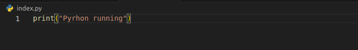
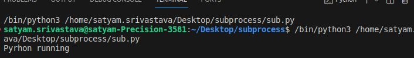

</details>

<details>
<summary>Python dataStructures</summary>

## Python dataStructures
```python
# list
list1 = ['physics', 'chemistry', 1997, 2000]
list2 = [1, 2, 3, 4, 5, 6, 7 ]
print ("list1[0]: ", list1[0])
print ("list2[1:5]: ", list2[1:5])
```
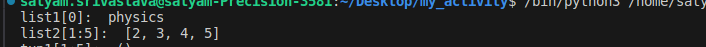

```python
# tuples
tup1 = ('physics', 'chemistry', 1997, 2000)
tup2 = (50,)
print ("tup1[1:5]: ", tup1[1:5])
```


```python
#dictionary
dict = {'Name': 'Zara', 'Age': 7, 'Class': 'First'}
print ("dict['Name']: ", dict['Name'])
print ("dict['Age']: ", dict['Age'])
```


```python
#sets
Months={"Jan","Feb","Feb"}
Days=set(["Mon","Tue","Wed","Mon","Tue","Wed",])
print(Days)
print(Months)
```

</details>

---

# 17/04/2024

<details>
<summary>Pandas</summary>

```python
import pandas as pd
import numpy as np

#Series
s=pd.Series([1,2,3,np.nan])
print (s)
```
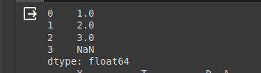

```python

#DataFrames
df= pd.DataFrame(
    {
        "X":5.0,
        "T":pd.Timestamp("20240417"),
        "D":pd.date_range("20240417",periods=4),
        "A":np.array([5]*4,dtype="int32")
    }
)
print(df)
```

```
print(df.head(2))
```

```
print(df.tail(1))
```


```
print(df.index)
```


```
print(df.to_numpy())
```


```
print(df.sort_index(axis=1,ascending=False))
```


```
print(df.sort_values(by="D"))
```


</details>

<details>
<summary>Docker</summary>

```python
#Start docker service
service docker start

#See docker status
service docker status
```
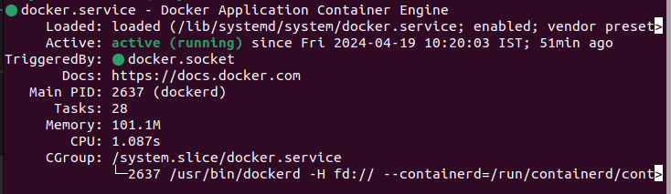


## Start Container
docker start satyam <br>


## Go inside Container
docker attach satyam

## See all containers (stopped+running)
docker ps -a <br>


## See all running Containers
docker ps <br>


## Deleting Containers
docker rm satyam


## Create image of container
docker commit satyam upimage <br>


## Create dockerfile
vi Dockerfile <br>
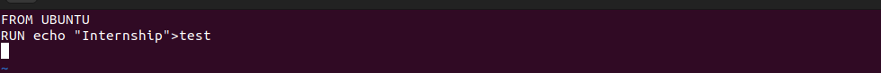

## Craete image from Dockerfile
docker build -t imgdockerfile . <br>
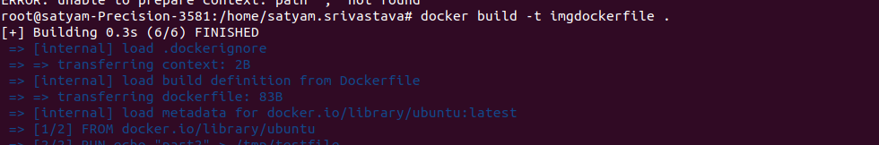

## Create container from image
docker run -it --name satyam ubuntu /bin/bash <br>

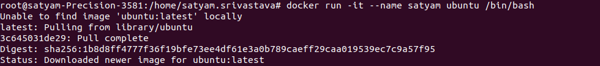


</details>

---

# 19/04/2024

<details>
<summary>Docker</summary>

## Docker network expose


```python
# network : host-container

# runs in background
docker run -td --name cont -p 3000:3000 img
```


## runs the conatiner and opens shell

```
docker run -it --name cont1 -p 3000:3000 img bash
```


## check the port of container
```
docker port cont
```

## or
```
docker ps -a
```


## go inside the existing container having network exposed

```
docker exec -it cont1 bash
```


</details>

<details>
<summary> MultiStage Docker </summary>
<br>

**This approach allows developers to compile or build applications in one stage, using a full-featured image that includes all necessary build tools and dependencies, and then copy only the compiled application or necessary files into a smaller, more secure runtime image. This results in a final image that is significantly smaller in size, contains only the necessary components to run the application, and reduces the attack surface by excluding unnecessary build tools and dependencies.**
```python
# First stage: Build the application
FROM ubuntu AS backend-builder
RUN apt update && apt-get install curl -y
RUN curl -fsSL https://deb.nodesource.com/setup_20.x | bash -
RUN apt-get install -y nodejs
WORKDIR /app
COPY . .
RUN npm install

# Second stage: Setup the runtime environment
FROM node:21-slim
WORKDIR /app

# Copy only the application code, not the node_modules directory
COPY --from=backend-builder /app .
EXPOSE 3000
ENTRYPOINT [ "node","server.js" ]
```
</details>
---

# 22/04/2024

<details>
<summary>CI/CD PIPELINE</summary>

**Whenever developers write code, we integrate all that code of all developers at that point of time we build, test and deploy to the client. This process is called CI/CD.
Jenkins helps us to achieve this. Because of CI, bugs will be reported fast to the clients and rectified at earlier stage. So the entire software development cycle happens fast.**

<br/>

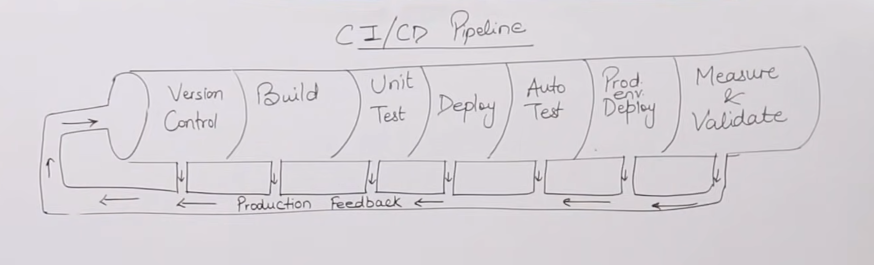

</details>

<details>
<summary>Jenkins</summary>

## enable jenkins service to start at boot
```
sudo systemctl enable jenkins
```
## start jenkins service
```
sudo systemctl start jenkins
```
## status of jenkins
```
sudo systemctl status jenkins
```
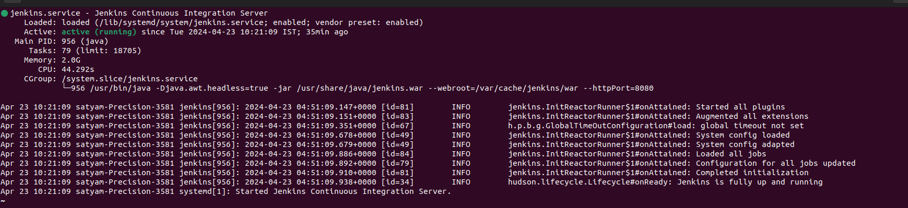
</details>
<details>
<summary>Integrated Jenkins with git , jdk,  maven , jdk</summary>

## click on Manage Jenkins


## Under System Configuration click on tools


## jdk integration
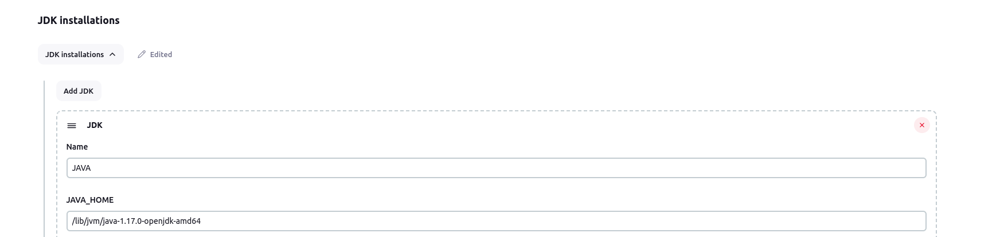

## git integration
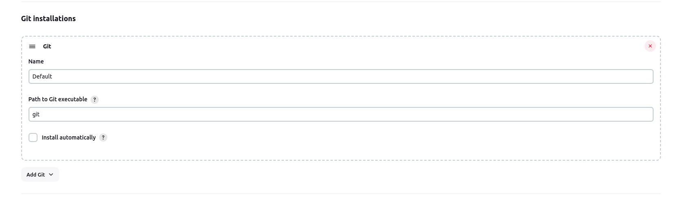

## maven integration
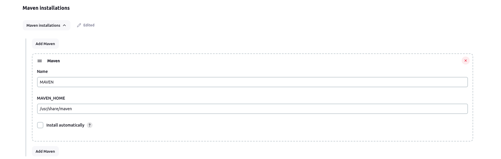


</details>

<details>
<summary>Building in Jenkins</summary>
<br>


</details>