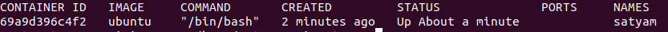
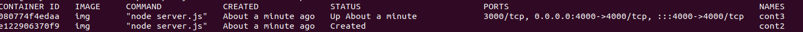
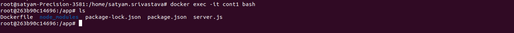

# 05/04/2024

- learnt git commands (add, commit, push, pull, branch, checkut, merge, reset)
- learnt markdown syntax
- learnt django
    - built a simple text analyzer which accepts a string and converts it into uppercase, lowercase and remove punctuation 
  ---
  
# 08/04/2024

- built a simple e-com website using django containing features like home , about, contact, services (fetching data from database)
- learnt postgress sql for integrating with django 
  

# 10/04/2024

- learnt react-redux and redux-toolkit
- learn how to fetch data using reddux-toolkit-query(RTK)
  
# 11/04/2024
  <details>
  <summary>Linux Commands</summary>

  ## File Operations

  - **ls**: List files and directories.
  - **Options**: `-l` (Long format listing), `-a` (Include hidden files), `-h` (Human-readable file sizes).
  - **Examples**: `ls -l`, `ls -a`, `ls -lh`.

  - **cd**: Change directory.
  - **Examples**: `cd /path`.

  - **pwd**: Print current working directory.
  - **Examples**: `pwd`.

  - **mkdir**: Create a new directory.
  - **Examples**: `mkdir my_directory`.

  - **rm**: Remove files and directories.
  - **Options**: `-r` (Remove directories recursively), `-f` (Force removal without confirmation).
  - **Examples**: `rm file.txt`, `rm -r my_directory`, `rm -f file.txt`.

  - **cp**: Copy files and directories.
  - **Options**: `-r`
  - **Examples**: `cp -r directory destination`, `cp file.txt destination`.

  - **mv**: Move/rename files and directories.
  - **Examples**: `mv file.txt new_name.txt`, `mv file.txt directory`.

  - **touch**: Create an empty file or update file timestamps.
  - **Examples**: `touch file.txt`.

  - **cat**: View the contents of a file.
  - **Examples**: `cat file.txt`.

  - **head**: Display the first few lines of a file.
  - **Options**: `-n` (Specify the number of lines to display).
  - **Examples**: `head file.txt`

  - **tail**: Display the last few lines of a file.
  - **Options**: `-n` (Specify the number of lines to display).
  - **Examples**: `tail file.txt`

  - **ln**: Create links between files.
  - **Options**: `-s` (Create symbolic (soft) links).
  - **Examples**: `ln -s source_file link_name`.

  - **find**: Search for files and directories.
  - **Options**: `-name`  `-type` 
  - **Examples**: `find /path -name "*.txt"`.

  ## File Permission Commands

  - **chmod**: Change file permissions.
  - **Options**: `u` (User/owner permissions), `g` (Group permissions)

  - **umask**: Set default file permissions.
  - **Examples**: `umask 022`.

  ## File Compression and Archiving Commands

  - **gzip**: Compress files.
  - **Examples**: `gzip file.txt`.

  - **zip**: Create compressed zip archives.
  - **Examples**: `zip archive.zip file1.txt file2.txt`.

  </details>
  
#### learnt about django-rest-framework

# 15/04/2024
  <details>
  <summary>OOP's</summary>

  ## Class and Object

  ```python
  class Car:
      total_calls = 0
      
      def __init__(self, model, brand):
          self.model = model
          self.brand = brand
          Car.total_calls += 1

      def __str__(self):
          return f"Model -> {self.model} & Brand -> {self.brand}, {Car.total_calls}"

  Maruti = Car("maruti", "new")
  print(Maruti)
  ```
  ## Inheritance
  ``` python
  class ElectricCar(Car):
      def __init__(self, model, brand, battery):
          super().__init__(model, brand)
          self.battery = battery
      
      def __str__(self):
          return f'Model->{self.model} , Brand->{self.brand} , Battery->{self.battery}, {Car.total_calls}'
      
  ec = ElectricCar("ola", "good", "85kwh")
  print(ec)
  ```

  ## Encapsulation
  ``` python
  class Employee:
      def __init__(self, name, salary):
          self.name = name
          self.__salary = salary  # private 

      def __str__(self):
          return f"Employee Name->{self.name} and salary->{self.__salary}" 
      
      def get_salary(self):
          return self.__salary
      
      def set_salary(self, salary):
          self.__salary = salary

  satyam = Employee("satyam", "10l")
  print(satyam)    

  print(satyam.get_salary())
  ```
  ## Static Methods
  ```python
  class Laptop:
      def __init__(self, brand):
          self.brand = brand

      @staticmethod
      def use():
          return f"Laptops are used for educational purposes"
      
      def __str__(self):
          return self.brand

  lenovo = Laptop("Lenovo")
  apple = Laptop("Apple")
  print(lenovo.use())  # Accessed through objects
  print(apple.use())   # Accessed through objects
  print(Laptop.use())  # Accessed through classes

  ```
  </details>


  <details>
  <summary>Decorators</summary>

  ## Timing Function

  ```python
  import time

  def toll(func):
      def wrapper():
          start = time.time()
          print("Before called")
          result = func()
          print("After called")
          end = time.time()
          print(f"{func.__name__} ran in {end-start}")
          return result
      return wrapper

  @toll
  def running_function():
      print("I am called")
      time.sleep(3)

  running_function()
  ```

  ## Debug function
  ``` python 
  def debug(func):
      def wrapper(*args, **kwargs):
          args_value = (",").join(args)
          kw_args = (',').join(f" {k}->{v}" for k, v in kwargs.items())
          print(f"calling {func.__name__} with args {args_value} and kwargs {kw_args}")
          result = func(*args, **kwargs)
          return result
      return wrapper

  @debug
  def database(name, description, use="development", db="database"):
      print("database is called")

  database("mongodb", "sql", use="development", db="database")

  ```
  </details>

  <details>
  <summary>exception handling</summary>

  ```python
  try:
      print('Resource opened')
      x=int(input("Enter 1st number b/w 1 to 100->"))
      if(x<1 or x>100):
          raise ValueError("number must be b/w 1 to 100->")
      y=int(input("Enter 2nd number"))
      z=x/y
      print(f"division{z}")
  except Exception as e:
      print(e)
  finally:
      print("Resource closed")
  ```

  </details>

  <details>
  <summary>multithreading</summary>

  ## Using `Thread` class

  ```python
  from threading import Thread
  from time import sleep, perf_counter

  class Employee(Thread):
      def run(self):
          for i in range(3):
              print("joined")
              sleep(2)

  class Salary(Thread):
      def run(self):
          for i in range(3):
              print("salary")
              sleep(1)

  t1 = Employee()
  t2 = Salary()

  start = perf_counter()
  t1.start()
  t2.start()

  t1.join()
  t2.join()
  end = perf_counter()

  print(f"Execution time: {end - start}")
  print("Main thread work")
  ```

  ## Using Thread with target function
  ```python
  def running(seconds):
      print(f"Sleeping for {seconds} seconds")
      sleep(seconds)

  start = perf_counter()

  t1 = Thread(target=running, args=[2])
  t2 = Thread(target=running, args=[3])
  t3 = Thread(target=running, args=[1])

  t1.start()
  t2.start()
  t3.start()

  t1.join()
  t2.join()
  t3.join()

  end = perf_counter()
  print(f"Execution time: {end - start}")

  ```

  ## Using concurrent.futures.ThreadPoolExecutor
  ```python
  from concurrent.futures import ThreadPoolExecutor
  from time import sleep, perf_counter

  def running(seconds):
      print(f"Sleeping for {seconds} seconds")
      sleep(seconds)
      return seconds

  with ThreadPoolExecutor(max_workers=1) as executor:
      thread1 = executor.submit(running, 3)
      print(thread1.result())

  with ThreadPoolExecutor(max_workers=1) as executor:
      thread2 = executor.submit(running, 2)
      print(thread2.result())

  with ThreadPoolExecutor(max_workers=1) as executor:
      thread3 = executor.submit(running, 1)
      print(thread3.result())

  ```

  ## Using concurrent.futures.ThreadPoolExecutor with map

  ```python
  from concurrent.futures import ThreadPoolExecutor
  from time import sleep, perf_counter

  def running(seconds):
      print(f"Sleeping for {seconds} seconds")
      sleep(seconds)
      return seconds

  l = [3, 2, 1]

  with ThreadPoolExecutor() as executor:
      start = perf_counter()
      results = executor.map(running, l)
      for result in results:
          print(result)
      end = perf_counter()
      print(f"Time for execution: {end - start}")

  ```
  </details>

  <details>
  <summary> venv </summary>

  ## Install venv
  - pip install virtualenv

  ## Create venv
  - python3 -m venv .venv

  ## Workon .venv
  - source .venv/bin/activate

  ## Install packages in venv
  - pip install django

  ## Display list of packages installed
  - pip freeze

  ## Make requirements.txt of installed packages
  - pip freeaze>requirements.txt

  ## Install packages from requiremnts.txt
  - pip install -r requirements.txt

  ## Deactivate venv
  - deactivate
  </details>


---

# 16/04/2024

<details>
<summary>Subproceess</summary>

## Subprocess
```python
import subprocess

def sp():
    python_scipt_path="./index.py"
    python_process=subprocess.run(["python3",python_scipt_path], stdout=subprocess.PIPE)

    print(python_process.stdout.decode())

sp()
```


</details>

<details>
<summary>Python dataStructures</summary>

## Python dataStructures
```python
# list
list1 = ['physics', 'chemistry', 1997, 2000]
list2 = [1, 2, 3, 4, 5, 6, 7 ]
print ("list1[0]: ", list1[0])
print ("list2[1:5]: ", list2[1:5])
```


```python
# tuples
tup1 = ('physics', 'chemistry', 1997, 2000)
tup2 = (50,)
print ("tup1[1:5]: ", tup1[1:5])
```


```python
#dictionary
dict = {'Name': 'Zara', 'Age': 7, 'Class': 'First'}
print ("dict['Name']: ", dict['Name'])
print ("dict['Age']: ", dict['Age'])
```


```python
#sets
Months={"Jan","Feb","Feb"}
Days=set(["Mon","Tue","Wed","Mon","Tue","Wed",])
print(Days)
print(Months)
```

</details>

---

# 17/04/2024

<details>
<summary>Pandas</summary>

```python
import pandas as pd
import numpy as np

#Series
s=pd.Series([1,2,3,np.nan])
print (s)
```


```python

#DataFrames
df= pd.DataFrame(
    {
        "X":5.0,
        "T":pd.Timestamp("20240417"),
        "D":pd.date_range("20240417",periods=4),
        "A":np.array([5]*4,dtype="int32")
    }
)
print(df)
```

```
print(df.head(2))
```

```
print(df.tail(1))
```


```
print(df.index)
```


```
print(df.to_numpy())
```


```
print(df.sort_index(axis=1,ascending=False))
```


```
print(df.sort_values(by="D"))
```


</details>

<details>
<summary>Docker</summary>

```python
#Start docker service
service docker start

#See docker status
service docker status
```


## Start Container
docker start satyam <br>


## Go inside Container
docker attach satyam

## See all containers (stopped+running)
docker ps -a <br>


## See all running Containers
docker ps <br>


## Deleting Containers
docker rm satyam


## Create image of container
docker commit satyam upimage <br>


## Create dockerfile
vi Dockerfile <br>


## Craete image from Dockerfile
docker build -t imgdockerfile . <br>


## Create container from image
docker run -it --name satyam ubuntu /bin/bash <br>


</details>

---

# 19/04/2024

<details>
<summary>Docker</summary>

## Docker network expose


```python
# network : host-container

# runs in background
docker run -td --name cont -p 3000:3000 img
```


## runs the conatiner and opens shell

```
docker run -it --name cont1 -p 3000:3000 img bash
```


## check the port of container
```
docker port cont
```

## or
```
docker ps -a
```


## go inside the existing container 

```
docker exec -it cont1 bash
```


</details>

<details>
<summary> MultiStage Docker </summary>
<br>

**This approach allows developers to compile or build applications in one stage, using a full-featured image that includes all necessary build tools and dependencies, and then copy only the compiled application or necessary files into a smaller, more secure runtime image. This results in a final image that is significantly smaller in size, contains only the necessary components to run the application, and reduces the attack surface by excluding unnecessary build tools and dependencies.**
```python
# First stage: Build the application
FROM ubuntu AS backend-builder
RUN apt update && apt-get install curl -y
RUN curl -fsSL https://deb.nodesource.com/setup_20.x | bash -
RUN apt-get install -y nodejs
WORKDIR /app
COPY . .
RUN npm install

# Second stage: Setup the runtime environment
FROM node:21-slim
WORKDIR /app

# Copy only the application code, not the node_modules directory
COPY --from=backend-builder /app .
EXPOSE 3000
ENTRYPOINT [ "node","server.js" ]
```
</details>
---

# 22/04/2024

<details>
<summary>CI/CD PIPELINE</summary>

**Whenever developers write code, we integrate all that code of all developers at that point of time we build, test and deploy to the client. This process is called CI/CD.
Jenkins helps us to achieve this. Because of CI, bugs will be reported fast to the clients and rectified at earlier stage. So the entire software development cycle happens fast.**

<br/>


</details>

<details>
<summary>Jenkins</summary>

## enable jenkins service to start at boot
```
sudo systemctl enable jenkins
```
## start jenkins service
```
sudo systemctl start jenkins
```
## status of jenkins
```
sudo systemctl status jenkins
```

</details>
<details>
<summary>Integrated Jenkins with git , jdk,  maven , jdk</summary>

## click on Manage Jenkins


## Under System Configuration click on tools


## jdk integration


## git integration


## maven integration


</details>

---
# 23/04/2024

<details>
<summary>Integrate MySql with Django</summary>

```python
#run
 sudo apt-get install python3-dev default-libmysqlclient-dev build-essential pkg-config
  pip install mysqlclient

```

```python
# RUN in MYSQL
CREATE DATABASE dj_server
USE dj_Server
CREATE USER satyam@localhost IDENTIFIED BY 'Satyam@123'
GRANT ALL PRIVILEGES ON dj_server.* TO satyam@localhost
```
```python
# We can login on MySql using
sudo mysql -u satyam -p
```

```python
# Configure it in settings.py of django-app root folder
DATABASES = {
    "default": {
        "ENGINE": "django.db.backends.mysql",
        "NAME": "dj_server",
        "USER": "satyam",
        "PASSWORD": "Satyam@123",
        "HOST": "127.0.0.1",
        "PORT": "3306",
    }
}
```
</details>

# 24/04/2024
<details>
<summary>Custom User Model in Django</summary>

```python
# managers.py
from django.contrib.auth.models import BaseUserManager

class UserManager(BaseUserManager):
    use_in_migrations = True
    def create_user(self,phone,email,password=None,**extra_fields):
        
        if not phone:
            raise ValueError('USer must have phone no')
        
        email=self.normalize_email(email)

        user= self.model(
            phone=phone,
            email=email,
            **extra_fields
        )
        user.set_password(password)
        user.save(using =self._db)
        return user


    def create_superuser(self,phone,email,password=None,**extra_fields):
        
        extra_fields.setdefault('is_staff',True)
        extra_fields.setdefault('is_superuser',True)
        extra_fields.setdefault('is_active',True)
        user=self.create_user(
            phone,
            email,
            password,
            **extra_fields
        )


        user.save(using=self._db)

        return user
```
```python
# models.py

from django.db import models
from django.contrib.auth.models import AbstractUser
from .manager import *
# Create your models here.

class CustomUser(AbstractUser):

    username=None
    name=models.CharField(max_length=50)

    email=models.EmailField(max_length=50,unique=True)
    phone=models.IntegerField(unique=True)
    bio =models.CharField(max_length=200)

    USERNAME_FIELD="phone"
    REQUIRED_FIELDS=["email"]
    objects=UserManager()


    def __str__(self) -> str:
        return self.email
    
```
```python
#register in admin.py
admin.site.register(CustomUser)

# set it in settings.py of root folder
AUTH_USER_MODEL='accounts.CustomUser'
```
</details>


# 25/04/2024

<details>
<summary>CRUD operations in Django </summary>

```python
# urls.py
from django.contrib import admin
from django.urls import path
from .views import *

urlpatterns = [
    path('',EmployeeAPI.as_view()),
    path('register',RegisterAPI.as_view())
]
```

```python
# serializers.py

from rest_framework import serializers
from .models import *
from django.contrib.auth.models import User


class UserSerializer(serializers.ModelSerializer):
    class Meta:
        model=User
        fields=["username","password"]

    def create(self, validated_data):
        user=User.objects.create(username=validated_data['username'])
        user.set_password(validated_data['password'])
        user.save()
        return user
    
class EmployeeSerializer(serializers.ModelSerializer):
    class Meta:
        model=Employee
        fields="__all__"

```

```python
# views.py 
from django.shortcuts import render
from rest_framework.views import APIView
from rest_framework.response import Response
from .serializers import *
from .models import *
# Create your views here.
from rest_framework_simplejwt.authentication import JWTAuthentication
from rest_framework.permissions import IsAuthenticated
from rest_framework_simplejwt.tokens import RefreshToken
from django.contrib.auth.models import User

class EmployeeAPI(APIView):
    authentication_classes = [JWTAuthentication]
    permission_classes = [IsAuthenticated]
    def get(self,req):
        Employee_objs=Employee.objects.all()
        serializer=EmployeeSerializer(Employee_objs,many=True)
        return Response({'status':'200', 'payload':serializer.data, 'message':"Kaise ho bhai"})


    def post(self,req):
        data= req.data
        serializer=EmployeeSerializer(data=data)

        if not serializer.is_valid():
            return Response({'status':400, 'errors':serializer.errors,'message':"Can't serialize"})
        
        serializer.save()

        return Response({'status':200,'payload':data, 'message':'data saved'})
    
    def patch(self,req):
        try:

            data=req.data
            current_user= Employee.objects.get(id=data['id'])
            serializer=EmployeeSerializer(current_user, data=req.data,partial=True)

            if not serializer.is_valid():
                return Response({'status':400, 'errors':serializer.errors,'message':"Can't serialize"})
            
            serializer.save()

            return Response({'status':200,'payload':data, 'message':'data saved'})
        
        except Exception as e:
            return Response({'status':400,'message':"invalid id"})
        

    def delete(self,req):
        try:
            data=req.data
            current_user= Employee.objects.get(id=data['id'])
            current_user.delete()
            return Response({'status':200, "message":"User deleted"})
        except Exception as e:
            return Response({'status':400,'message':"Invalid Id"})
        
    

class  RegisterAPI(APIView):
    def post(self,req):
        data=req.data
        serializer=UserSerializer(data=data)
        if not serializer.is_valid():
            return Response({'status':200,'message':serializer.errors})
        
        serializer.save()   
        user=User.objects.get(username=serializer.data['username'])
        refresh = RefreshToken.for_user(user)
        token = refresh.access_token
        return  Response({'status':200,'message':'registered','token':str(token)})
    
```
</details>


<details>
<summary>JWT AUTHENTICATION </summary>

```python
pip install django djangorestframework djangorestframework_simplejwt

# installed_Apps in setitings.py
  'rest_framework',
    'rest_framework_simplejwt',
```
```python
# rest_framework in settins.py
REST_FRAMEWORK = {
    
    'DEFAULT_AUTHENTICATION_CLASSES': (
        'rest_framework_simplejwt.authentication.JWTAuthentication',
    )
    
}

```
```python
# in views.py import
from rest_framework_simplejwt.authentication import JWTAuthentication
from rest_framework.permissions import IsAuthenticated
from rest_framework_simplejwt.tokens import RefreshToken 

```
```python
# wherever y require, simply load the classes[ authentication_classes and permission_classes]
class EmployeeAPI(APIView):
    authentication_classes = [JWTAuthentication]
    permission_classes = [IsAuthenticated]
    def get(self,req):
        Employee_objs=Employee.objects.all()
        serializer=EmployeeSerializer(Employee_objs,many=True)
        return Response({'status':'200', 'payload':serializer.data, 'message':"Kaise ho bhai"})
```

</details>

# 29/04/2024

<details>
<summary>DockerCompose</summary>

```python
services:
    web:
        image:"nginx"
    rcache:
        image:"redis:${redis-tag}"
    db:
        image:mysql
 
```
```python
# to see the configurations in dockercompose
docker compose config
```
```python
# create and start containers in dockercompose.yml
docker compose up -d
```
```python
# see all containers definded in dockercompose
docker compose ps -a
```
```python
# to go inside conatiners started in dockeer
docker compose exec web bash
```
```python
# to stop down the conatiners in dockercompose
docker compose down
```

```python
# through environment keywords

services:
    db:
        image:mysql
        environmnet:
        - MYSQL_ROOT_PASSWORD=hi123

```
```python
# through environment files

services:
    db:
        image:mysql
        env_file:
        - mysql.config

```

```python
# providing profiles to services

services:
    db:
        image:mysql
        env_file:
        - mysql.config
        profiles:
            database

# if we want db service to perform any operation , we need to mention it's profile must

docker compose --profile database config

docker compose --profile database up -d

```
```python
# depends_on

services:
    web:
        image:"nginx"
        depends_on:
        - rcache
        - mysql

    rcache:
        image:"redis:${redis-tag}"
    db:
        image:mysql
```

```python
# ports exposure
services:
    web:
        image:"nginx"
        depends_on:
        - rcache
        - mysql

        ports:
        - 8000:80 # host m/c -> container
    rcache:
        image:"redis:${redis-tag}"
    db:
        image:mysql

```

```python
# network exposure
services:
    web:
        image:"nginx"
        depends_on:
        - rcache
        - mysql

        ports:
        - 8000:80 # host m/c -> container

        networks:
        - my_network #custom network to which service nginx will operate on
    rcache:
        image:"redis:${redis-tag}"
    db:
        image:mysql

```

</details>

# 30/04/2024

- revised all the concepts of docker and jenkins
- debugged the errors of django app and mysql integration

# 02/05/2024
<details>
<summary>Dockerized a django+mysql app</summary>

```python
# docker-compose .yml
services:
  docker-service:
    build: .
    container_name: drf
    image: drf-image
    ports:
      - 8000:8000
    depends_on:
      - database
    command: python manage.py runserver 0.0.0.0:8000
  database:
    restart: always
    container_name: dbcont
    image: mysql
    volumes:
      - vol1:/var/lib/mysql
    environment:
      - MYSQL_ROOT_PASSWORD=root@123 
      - MYSQL_DATABASE=dj_work
       
volumes:
  vol1:

```
</details>

<details>
<summary> MultiStage Docker </summary>
<br>

**This approach allows developers to compile or build applications in one stage, using a full-featured image that includes all necessary build tools and dependencies, and then copy only the compiled application or necessary files into a smaller, more secure runtime image. This results in a final image that is significantly smaller in size, contains only the necessary components to run the application, and reduces the attack surface by excluding unnecessary build tools and dependencies.**
```python
# First stage: Build the application
FROM ubuntu AS backend-builder
RUN apt update && apt-get install curl -y
RUN curl -fsSL https://deb.nodesource.com/setup_20.x | bash -
RUN apt-get install -y nodejs
WORKDIR /app
COPY . .
RUN npm install

# Second stage: Setup the runtime environment
FROM node:21-slim
WORKDIR /app

# Copy only the application code, not the node_modules directory
COPY --from=backend-builder /app .
EXPOSE 3000
ENTRYPOINT [ "node","server.js" ]
```
</details>

---

# 03/05/2024

<details>
<summary> React-Redux data management</summary>

```python
# slices.js
import { createSlice } from '@reduxjs/toolkit'


export const userSlice=createSlice({
  name: 'slice1',
  initialState:{
    list:[],
    curr:""
  } ,
  curr:"",
  reducers: {
    
    get_user:(state,action)=>{
        state.list=action.payload;
    },
    // add_user:(state,action)=>{

    // },
    edit_user:(state,action)=>{
      let ind= state.list.findIndex(user=>user._id==action.payload)
        state.curr=state.list[ind]
    },
    delete_user:(state,action)=>{
      state.list=state.list.filter(user=>user._id!==action.payload)
    }

  },
})

// Action creators are generated for each case reducer function
export const {get_user, add_user, edit_user, delete_user } = userSlice.actions

export default userSlice.reducer
```

```python
# store.js
import { configureStore } from '@reduxjs/toolkit'
import userReducer from './slices'


export default configureStore({
  reducer: {
    userStore:userReducer
  },
})
```

```python
# main.js [wrapping up APP with Provider]
import React from 'react'
import ReactDOM from 'react-dom/client'
import App from './App.jsx'
import "./index.css"
import { ApiProvider } from '@reduxjs/toolkit/query/react'
import { myApi } from './rtk/services.js'
import { Provider } from 'react-redux'
import store from "./store/store.js"

ReactDOM.createRoot(document.getElementById('root')).render(
  <React.StrictMode>

<Provider store={store}>
 
    <App />

    </Provider>
  </React.StrictMode>,
)
```

```python
# to send data to states
import { useDispatch,useSelector } from 'react-redux';

  const data= useSelector((state)=>{
    return state.userStore.list
  });
  console.log(data);

  const getAllUsers=async()=>{
    
      const response = await fetch ("http://localhost:7000/api/show",{
        headers:{
          'Content-Type':'application.json',
        },
        method:"GET"
      })

      if(response.ok){
        const data= await response.json();
        dispatch(get_user(data));
      }
  }


```

```python
# to get data from state
import { useSelector } from 'react-redux';

export const CreateContact = () => {

  const data= useSelector((state)=>{
    return state.userStore.list
  });
  console.log(data);

```

</details>

---

# 06/05/2024

<details>
<summary>RTK Query</summary>

```python
# creating services
import { createApi, fetchBaseQuery } from '@reduxjs/toolkit/query/react'

export const myApi = createApi({
  reducerPath: 'api',
  baseQuery: fetchBaseQuery({ baseUrl: 'http://localhost:7000/api/' }),
  endpoints: (builder) => ({
    getAllUsers: builder.query({
      query:()  => "show",
    }),
  }),
})

export const { useGetAllUsersQuery } = myApi
```
```python
# wrapping up main.js with store
import { myApi } from './rtk/services.js'

 <ApiProvider api={myapi}>
    <App />
</ApiProvider>

```

```python
 # using api wherever needed
import {useGetAllUsersQuery} from '../rtk/servcies'
 const App=()=>{
    const [data,error,isLoading,isSuccess,isError]=
    useGetAllUsersQuery("")
 }
````
</details>

---

# 07/05/2024
 - set up openhorizon configuration on my laptop

---

# 08/05/2024
- analyzed code of open horizon and database

# 09/05/2024
- analyzed mysql tables of openhorizon project and found relationship among them
- tried to dockerize darabase code of openhorizon

# 10/05/2024
- tried on dockerizing mysql image
- mysql is unable to connect to localhost through socket

# 16/05/2024
- revised all the docker concepts 
- tried to dockerize backend image

# 17/05/2024
- dockerized backend image taking  python as base image
- port exposed and tested 
- facing problems with migrations  

# 20/05/2024
- learnt about different volume drivers 
- implemented volumes for monitoring backend container
- facing problems with migrations

# 21/05/2024
- implemented volumes for mysql for persistent storage
- backend conatiner facing problems with logs 

# 22/05/2024
- tried to connect backend container with local mysql server
- tried to fix up log issues with backend container

# 23/05/2024
- fixed up issue with logging of backend contaienrs
- facing problems with migrations of backend containers

# 24/05/2024
- tried to implement wait script in backend container to apply migrations
- analyzing wait-for-it script

# 27/05/2024
- implemented wait-for-it script in backend container to apply migrations
- explored docker networks

# 28/05/2024
- tried to connect backend container  with local mysql through host network and bridge network
- explored which option among host and bridge is good to have

# 29/05/2024
- connected backend container with local mysql server with dns name "host.docker.internal" and gateway "host:gateway"
- similarly watched on healthscript as an alternative for wait-for-it script since it requires conection to github which may be time consuming

# 30/05/2024
- implemented healthcare for database container and established service dependency from backend container to database container through healthchecks
- put backend container and database container in a BRIDGE NETWORK
- used backend contaiers to run both in dev-env(runserver) and prod-env(gunicorn with wsgi and asgi)

# 31/05/2024
- set up guniciorn sockets in my local system
- explored about gunicorn sockets and ports
- explored about wsgi(web server gateway interface,[synchronous]) and asgi(asynchronous server gateway interface[asynchronous]) and which is good to have

# 03/06/2024
- tried to dockerize frontend image
- learnt about docker cache mechanisms
- implemented cache mechanisms in frontend containers 
- tried multistaging mechanism in backend container

# 04/06/2024
- implemented multistaging in frontend container  through build file made in Stage1
- frontend image size reduced from 2.2 GB to 470 MB
- frontend container to run in dev-env(npm start) and prod-env(npm serve)

# 05/06/2024
- implemented volumes in frontend conatainers for persistent storage
- made frontend, backend ,and databse containers in same network and ensured that they are able to connect with each other

# 07/06/2024
- analyzed develop-watch actions for implementing dynamic changes in dev environment
- tried to implement watch in all the conatiners

# 10/06/2024
- we have 3 options : sync , sync+restart, rebuild, explored which option to mantain in which situations
- restart is giving SIGTERM error, tried to debug

# 11/06/2024
- SIGTERM error is caused because the default containers which docker create are special containers treated by docker, so by initailizing "init:true",
    we can instruct docker to treat them as processes under pid-1
- tried  restart options: on-failure, unless-stopped and always

# 12/06/2024
- tried edge cases regarding changes to env, requirements.txt, package.json
- made ppt for open-horizon demonstration of dockerization

# 13/06/2024
- tried edge cases for volumes in docker-compose
- demonstration of ppt 

# 14/06/2024
<details>
<summary>architecture of kubernetes</summary>
- Master (Control Plane) and Worker/minion <br>
- Master node contains Control Manager, kube scheduler, etcd cluster and API-Server<br>
Control Manager: Makes sure that actual state of cluster matches to desired state
- The components of api-server are:

    - kube api-server: api server interacts directly with the user and scales automatically as per load
    - etcd : stores metadata and states of cluster, fully replicated-> entire state is avialable on every node on cluster
    - kube-scheduler : it assigns any node to create and run pods. For every pod that scheduler discovers, it becomes responsible for finding the best node for that pod.

Worker/ Minion nodes:

    - kubelet: agent running on node and listening to master node . Uses port 10255
    - Container Engine: works with kubenet. Pulling images, Exposing containers on ports specified
    - kube-proxy- assigns IP address to each pod. By ruuning on each node, it makes sure that each pod will get it's own unique IP address
    - POD : Smallest unit of k8s. It is a group of one or more containers deployed on same host(node)
</details>
<details>
<summary> Working with minikube </summary>

    - to get all pods running:
        kubectl get pods:
    - to get ip addresses of all pods running:
        kubectl get pods -o wide
    - to see what all activies occured on pod:
        kubectl describe pod pod_name 
    - to see the logs of containers running on pods:
        kubectl logs -f testpod -c c01
    - to delete a pod:
        kubectl delete pod testpod
            or
        kubectl delete -f mypod.yml
    - to go inside container of pod
        kubectl exec testpod -it -c c01 -- /bin/bash
    

 </details>
 
# 17/06/2024
<details>
<summary>Labels </summary>

    - kind:POd
      apiVersion:v1
      metadata:
        name:testpod
        labels:
            env: dev
            class: tg
    - to get pods with labels:
     kubectl get pods --show-labels
    - add labels to existiing pods:
        kubectl label pods testpod -- myname=satyam
    - list pods matching a label:
        kubectl get pods -l env=dev
    - list pods not matching a label:
        kubectl get pods -l env!=dev

</details>

<details>
<summary>Label-Selectors</summary>

    Equality based:
        kubectl get pods -l myname=satyam, env=dev
    Set based:
        kubectl get pods -l 'env not in (prod,test)'
</details>

<details>
<summary>Node- Selectors</summary>

    label the node:
        kubectl label node node_name hardware=t2_medium

    testpod.yml:
    kind:Pod
    apiVersion:v1
    metadata:
        name:testpod
    spec:
        containers:
            -name:c00
             image:ubuntu
             command:[]
    nodeSelector:
        hardware:t2-medium

</details>

# 18/06/2024

<details>
<summary>Replication </summary>

    kind:ReplicationController
    apiVersion: v1
    metadata:
        name:myreplica
    spec:
        replicas:4
        selector:
            myname:satyam
    template:
        metadata:
            name:testpod
        labels:
            myname:satyam
        spec:
          containers:
            -name:c00
             image:ubuntu
             command:[]

kubectl get rc
kubectl describe rc myreplica

scale up/down the replicas
kubectl scale --replicas=8 rc -l myname=satyam
</details>

<details>
<summary>Replica Set</summary>

    kind:REplicationSet
    apiVersion:v1
    metadata:
        name:myrs
    spec:
        replicas:2
        selector:
            matchExpressions:
                - {key:env, operator:In, values:['dev','develop','development']}
    template:
        metadata:
            name:testpod
            labels:
                env:develop
        spec:
          containers:
            -name:c00
             image:ubuntu
             command:[]

    kubectl get rs
    kubectl scale --replicas=1 rs myrs
</details>
<details>
<summary>Deployment and Rollback</summary>

    Deployment->ReplicaSet->Pods

    mydeploy.yml:
    kind: Deployment
    apiVersion:v1
    metadata:
        myname:mydeploy
    spec:
        replicas:4
        selector:
            matchLabels:
                name:prod
    template:
        metadata:
            name:testpod
            labels:
                name:prod
        spec:
          containers:
            -name:c00
             image:ubuntu
             command:[]

    kubectl get deploy
    kubectl describe deploy mydeploy
    kubectl scale --replicas=1 deploy mydeploy

    -> Now, did some changes in mydeploy.yml
    kubectl rollout status deploy mydeploy
    kubectl rollout history deploy mydeploy
    kubectl rollout undo deploy mydeploy


</details>